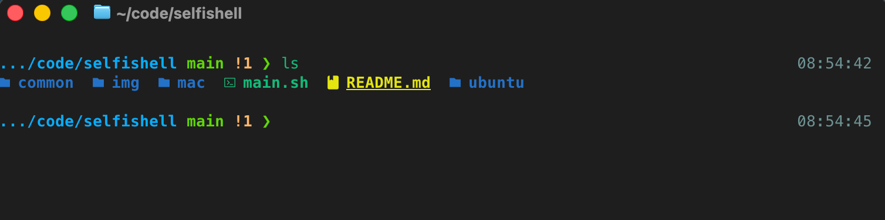

# Selfishell

Selfishell is an all-in-one Zsh environment for people who want a polished
terminal without spending hours installing tools, collecting dotfiles, and
maintaining shell plugins by hand.

It installs a practical set of terminal tools and keeps your Zsh, Starship,
editor, aliases, completions, and optional Ghostty configuration consistent
across macOS and Ubuntu.



## Who Is It For?

Selfishell is a good fit if you

- want a useful terminal setup that works immediately;
- use multiple Macs, Ubuntu machines, or Ubuntu on WSL;
- want Git, kubectl, mise-managed runtimes, aliases, and completions configured
  consistently;
- prefer a small managed configuration over assembling a large framework such
  as Oh My Zsh;
- want updates and rollback without manually replacing dotfiles.

It may not be the right choice if you already maintain a heavily customized
shell framework or want every package and configuration file managed
independently.

## What You Get

- a readable Starship prompt with Git and runtime information;
- Zsh completion (powered by fzf-tab) and aliases for common Git, shell, and
  kubectl workflows;
- FZF, Zoxide, Ripgrep, Eza, Bat, and Vim in the default profile; Neovim
  (configured with lazy.nvim) is in the developer profile;
- optional mise-managed Python, Node.js, Java, kubectl, and kubectx, plus jq and build tools;
- managed configuration with safe backups where Selfishell replaces existing paths;
- one-command updates, release notifications, checksum verification, and
  offline rollback.

Selfishell supports:

- macOS on Apple Silicon and Intel;
- native Ubuntu on AMD64 and ARM64;
- Ubuntu on WSL.

Other Linux distributions are not currently supported.

## Installation

### 1. Install the CLI

```bash
curl -fsSL https://raw.githubusercontent.com/jiminu/selfishell/main/install.sh | bash
```

The bootstrap installs only the `selfishell` CLI and its shorter `sfs` alias
under `~/.local/bin`. If the installer reports that this directory is not in
`PATH`, follow the `export` command it prints. The bootstrap does not modify
shell startup files unless explicitly requested.

To add the CLI directory to `~/.bashrc` or `~/.zshrc` automatically:

```bash
curl -fsSL https://raw.githubusercontent.com/jiminu/selfishell/main/install.sh |
  bash -s -- --add-to-path
```

The option uses the current default shell and adds an idempotent, tracked PATH
entry. Open a new shell afterward, or run the printed `export` command
immediately.

### 2. Install a profile

For a comfortable general-purpose terminal:

```bash
selfishell install
```

This installs the default `minimal` profile. For a workstation with language
runtimes, Kubernetes tools, jq, build dependencies, OpenJDK 17, and Neovim:

```bash
selfishell install --profile developer
```

The installer shows what it is doing and asks before changing the environment.
On macOS, it also asks whether to install and configure Ghostty.
If Zsh is installed, it also offers to set it as the current user's login shell.

### 3. Open a new terminal

Open a new terminal window after setup, or reload the current Zsh session:

```bash
exec zsh
```

### 4. Verify the installation

```bash
selfishell doctor
selfishell status
```

To install the CLI and the default profile non-interactively in one command:

```bash
curl -fsSL https://raw.githubusercontent.com/jiminu/selfishell/main/install.sh |
  bash -s -- --setup --yes
```

For company or security-sensitive environments, download and review the
bootstrap before running it:

```bash
curl -fLO https://raw.githubusercontent.com/jiminu/selfishell/main/install.sh
less install.sh
bash install.sh
```

Release archives are checked against their published `SHA256SUMS` before they
are activated.

## Profiles

| Profile | Included tools |
| --- | --- |
| `minimal` | Zsh, Git, Curl, Starship, Zinit, FZF (with fzf-tab), Zoxide, Ripgrep, Eza, Bat, and macOS terminal fonts |
| `developer` | Everything in `minimal`, plus Neovim 0.12.4 (with pinned lazy.nvim plugins), Tree-sitter CLI 0.26.11, mise, Node.js 24.18.0, Python 3.13.14, Temurin 17.0.19+10, kubectl 1.36.2, kubectx 0.9.5, jq, and compiler tools |

`minimal` is the default and uses Vim for the base editor. Preview the
developer profile without changing anything:

```bash
selfishell install --profile developer --dry-run
```

You can change an existing installation from `minimal` to `developer` by
running the developer installation command. Existing managed settings are
updated safely. In `developer`, `vim` and `vi` resolve to Neovim.

Packages marked optional by a profile are recommended packages: Selfishell
attempts to install them automatically but continues if they are unavailable.
Ghostty remains a separate interactive choice on macOS.

## Neovim Workflow

The `developer` profile includes a pinned Neovim configuration whose leader key
is `Space`. In Normal mode, press `Space` and pause to open which-key. The popup
shows the actions available in the current context; continue typing to narrow
the list. Every Selfishell mapping has a description, so which-key stays aligned
with the installed configuration without requiring a separate shortcut list.

LSP actions and symbol searches become available when a configured server is
attached. Selfishell currently configures Lua, Python, and Bash/sh, while
Neovim 0.12's standard LSP mappings remain available as well.

The configuration opens new splits to the right and below, keeps four lines of
context above and below the cursor when possible, confirms commands that would
discard unsaved changes, and previews `:substitute` results in a split before
they are applied.

## Everyday Commands

```bash
selfishell status                   # Show the active profile and managed resources
selfishell status --check-updates   # Also check for a newer Selfishell release
selfishell status --check-package-updates # Report available Homebrew/APT updates without installing
selfishell doctor                   # Diagnose the current installation
selfishell update                   # Update the CLI, profile tools, and configuration
selfishell rollback                 # Return to the previous Selfishell release
```

`selfishell update` activates the latest CLI first and then continues with that
release's profile, so newly added packages and configuration are applied in the
same command. Rerunning the bootstrap follows the same retention policy: only
the active release and one rollback release are kept.

`sfs` is available as a shorter interactive alias for the same commands.

Interactive Zsh sessions use a small local cache to announce new releases at
most once per day. The network check runs in the background and never installs
an update automatically.

## Uninstallation

### Remove Selfishell configuration

Preview the operation first:

```bash
selfishell uninstall --restore --dry-run
```

Then remove managed configuration and restore files backed up during
installation:

```bash
selfishell uninstall --restore
```

If a managed file has been modified since installation, Selfishell stops before
removing anything so that it does not overwrite your changes.

### Remove everything managed by Selfishell

To restore backed-up configuration and also remove the CLI, releases, cache,
and remaining state in one operation:

```bash
selfishell uninstall --restore --purge
```

Selfishell intentionally does not uninstall Homebrew/APT packages or tools such
as Zinit and Neovim plugins. They may be shared with other configurations and
should be removed separately only if you no longer use them. Personal Zsh
configuration in `~/.zshrc` is preserved; only the intact Selfishell loader
block is removed. If installation used `--add-to-path`, purge also removes the
unchanged PATH entry created by the installer. It stops and preserves the
startup file if that entry was edited.

## Existing Configuration and Safety

During managed installation, `~/.zshrc` remains a regular, user-owned file.
Selfishell adds one marked loader block and manages only that block, so aliases,
exports, functions, PATH entries, and third-party installer changes can be added
directly to `.zshrc`. Existing Vim, Starship, and Ghostty paths are moved to
timestamped backups before Selfishell creates managed links. Configuration is
copied under `${XDG_CONFIG_HOME:-$HOME/.config}/selfishell`, while recovery
metadata is kept under `${XDG_STATE_HOME:-$HOME/.local/state}/selfishell`.

Package installation may request administrator privileges for Homebrew or APT.
Network access is required for initial package and plugin downloads.

Direct downloads are version-pinned and checksum-verified. Git dependencies are
checked out at approved tags or commits defined in `dependencies.conf`.
Developer runtimes, Neovim, and versioned Kubernetes tools are installed by
mise or the platform package manager from Selfishell-managed configuration.
Project `mise.toml` files can override those defaults. Existing NVM and pyenv
directories are left untouched.

## Advanced Setup

Install an exact Selfishell release:

```bash
curl -fsSL https://raw.githubusercontent.com/jiminu/selfishell/main/install.sh |
  bash -s -- --version 0.3.1
```

Install configuration without package or network operations:

```bash
SELFISHELL_OFFLINE=1 selfishell install --profile developer --yes
# or
selfishell install --profile developer --skip-packages --yes
```

Standard `HTTP_PROXY`, `HTTPS_PROXY`, and `NO_PROXY` variables are inherited by
package managers and download commands.

Add private or company packages with a local profile:

```text
# company.conf
package macos required formula company-cli
package ubuntu required apt company-cli
```

```bash
selfishell install --profile developer --local-profile ./company.conf --yes
```

Add personal shell configuration directly to `~/.zshrc`, outside the marked
Selfishell loader block. Selfishell does not checksum or manage the rest of the
file.

## Development

Commands can be run directly from a source checkout while developing:

```bash
./bin/selfishell help
./bin/selfishell install --dry-run
bash scripts/check.sh
```

## Documentation

- [Installation](docs/INSTALLATION.md)
- [Profiles](docs/PROFILES.md)
- [Updates and rollback](docs/UPDATES.md)
- [Shell performance](docs/PERFORMANCE.md)
- [Company deployment](docs/COMPANY.md)
- [Security model](docs/SECURITY.md)
- [Troubleshooting](docs/TROUBLESHOOTING.md)
- [Release process](docs/RELEASING.md)
- [Vulnerability reporting](SECURITY.md)

## Platform Notes

- On WSL, install and select a Nerd Font in Windows Terminal or VS Code so
  Starship icons render correctly.
- On macOS, restart Ghostty after installation to apply its configuration.
- Optional packages unavailable on a distribution are reported without
  stopping required setup; missing required packages stop installation.
