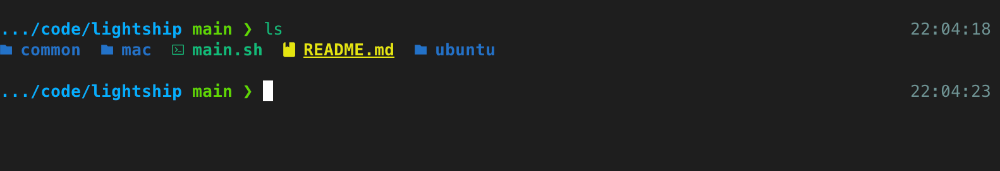

# Lightship

A lightweight and intuitive Zsh environment powered by Starship and Zinit. Lightship stays fast and readable while providing useful completions, aliases, runtime information, and Git status at a glance.

## Preview



Lightship keeps the primary prompt focused on the current directory and Git status, while contextual information such as the time appears on the right.

## Usage

Clone this repository and run:

```bash
bash ./main.sh
```

`main.sh` detects the current environment and runs the appropriate setup for macOS or Ubuntu on WSL.

## What It Installs

### macOS

- Homebrew
- Zsh tools: Starship, Zinit, Zoxide, FZF
- CLI tools: Git, Eza, Bat, kubectl, kubectx
- Runtime tools: pyenv, NVM, OpenJDK 17
- Vim and Vundle configuration
- Ghostty
- Meslo Nerd Font and Noto Sans CJK KR

### Ubuntu on WSL

- Zsh, Git, Curl, Unzip, and build tools
- Starship, Zinit, Zoxide, FZF
- Eza, Bat, Vim
- pyenv and NVM
- Vundle and Vim plugins
- Zsh as the default shell

The setup also links the shared Zsh, Starship, and Vim configuration files into the appropriate locations under the home directory.

## Notes

- Only macOS and Ubuntu on WSL are supported.
- The setup may request administrator privileges for Homebrew, apt packages, or changing the default shell.
- Existing configuration files and symbolic links are backed up with a timestamp before replacement.
- Network access is required to download packages and plugins.
- Open a new terminal after installation, or run `source ~/.zshrc`.
- On WSL, fonts are rendered by the Windows terminal application. Install a Nerd Font on Windows and select it in Windows Terminal or VS Code to display Starship icons correctly.
- On macOS, restart Ghostty after installation to apply its configuration.
