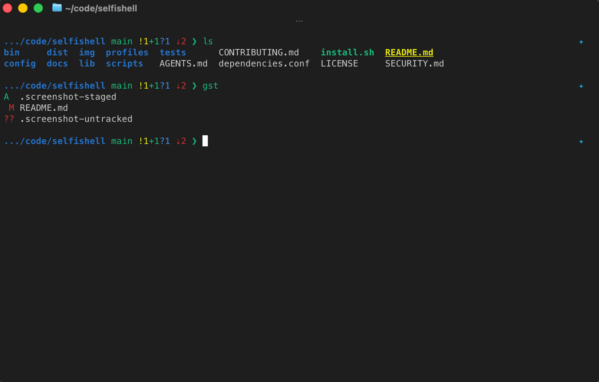
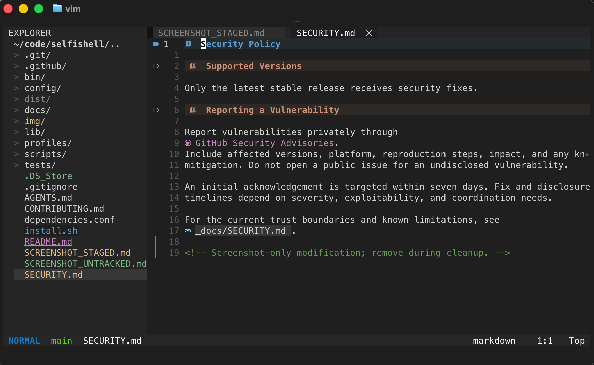

# Selfishell

Selfishell is a managed Zsh development environment for macOS, Ubuntu, and
Ubuntu on WSL.



## Quick Start

Install the CLI:

```bash
curl -fsSL https://raw.githubusercontent.com/jiminu/selfishell/main/install.sh | bash
```

Then install the default `developer` environment and verify it:

```bash
selfishell install
exec zsh
selfishell doctor
selfishell status
```

The bootstrap installs only the CLI. If it reports that `~/.local/bin` is not in
`PATH`, run the `export PATH=…` command it prints before continuing. See the
[installation guide](docs/INSTALLATION.md) for exact-version and
non-interactive installation, configuration-only setup, uninstallation,
Ghostty, and platform notes.

## What You Get

- A consistent Zsh environment across supported macOS and Ubuntu systems.
- A Starship prompt, useful aliases, completions, and managed shell defaults.
- `minimal` and `developer` profiles, with Neovim and development tooling in
  the developer profile.
- Checksum-verified release updates and a retained release for offline rollback.
- User-owned shell files: personal aliases, exports, functions, and project
  tooling stay outside Selfishell-managed blocks.



## Profiles

`developer` is the default profile; choose `minimal` explicitly for a lighter
shell setup.

| Profile | Includes |
| --- | --- |
| `minimal` | Core Zsh, Git, Vim, Starship, Zinit, and shell configuration |
| `developer` | Everything in `minimal`, plus Neovim, mise-managed runtimes, CLI/editor tools, and build tooling |

See [Profiles](docs/PROFILES.md) for the complete package list and profile
behavior.

## Everyday Commands

| Command | Use it to |
| --- | --- |
| `selfishell status` | Show the active profile, managed resources, and CLI/rollback version. |
| `selfishell doctor` | Diagnose the current installation. |
| `selfishell version --available` | Check the latest published release. |
| `selfishell update` | Update the CLI, profile tools, and configuration. |
| `selfishell rollback` | Return to the previous retained release offline. |
| `selfishell uninstall --restore --dry-run` | Preview restoring backed-up configuration. |

`sfs` is the optional short alias for `selfishell`. See
[Updates and rollback](docs/UPDATES.md) for update modes and recovery behavior.

## Safety

Selfishell installs its own files without root into XDG-compatible user paths,
backs up existing managed paths, keeps user shell files user-owned, verifies
release checksums, and never installs updates automatically during shell
startup.

## Documentation

### User guides

- [Installation](docs/INSTALLATION.md) — setup, uninstallation, Ghostty, and
  platform notes.
- [Profiles](docs/PROFILES.md) — package choices and Neovim workflow.
- [Python development](docs/PYTHON.md) — Python tooling and project setup.
- [Updates and rollback](docs/UPDATES.md) — release updates and recovery.
- [Troubleshooting](docs/TROUBLESHOOTING.md) — common installation and shell
  problems.
- [Security model](docs/SECURITY.md) — trust boundaries and security guarantees.
- [Company deployment](docs/COMPANY.md) — organization-specific installation.
- [Shell performance](docs/PERFORMANCE.md) — startup measurement and profiling.

### Project and maintainer guides

- [Contributing](CONTRIBUTING.md) — source checkout and verification.
- [Release process](docs/RELEASING.md) — tag-driven publishing and verification.
- [Vulnerability reporting](SECURITY.md) — report a security issue privately.
